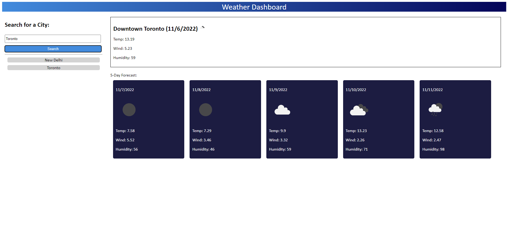

# Weather-forecast-app Challenge week 6
## Description
This repository contains the week 6 challenge. The challenge consists of various acceptance criteria as mentioned below: 
GIVEN a weather dashboard with form inputs 
WHEN I search for a city 
THEN I am presented with current and future conditions for that city and that city is added to the search history 
WHEN I view current weather conditions for that city 
THEN I am presented with the city name, the date, an icon representation of weather conditions, the temperature, the humidity, and the the wind speed 
WHEN I view future weather conditions for that city 
THEN I am presented with a 5-day forecast that displays the date, an icon representation of weather conditions, the temperature, the wind speed, and the humidity 
WHEN I click on a city in the search history 
THEN I am again presented with current and future conditions for that city 
##Usage
To use this module click following link: https://ekamjotsidhu.github.io/Weather-forecast-app/ 
The screenshot below shows the final webpage
    
